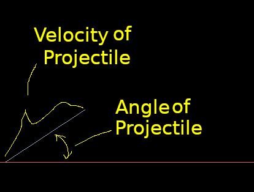

= 2D Projectile Motion

== About
Simulates projectile motion by using the kinematics equations.

== How to Play
Right click your mouse to launch a projectile. The line from the ground to the
mouse is the velocity and the angle of that line relative to the ground is the
angle of the launch projectile.

